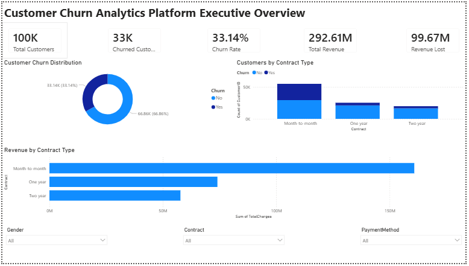
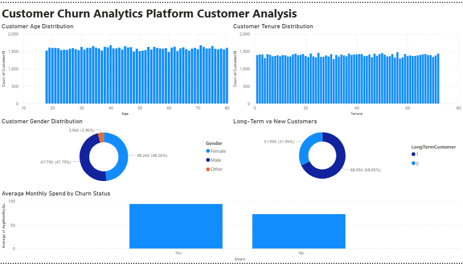
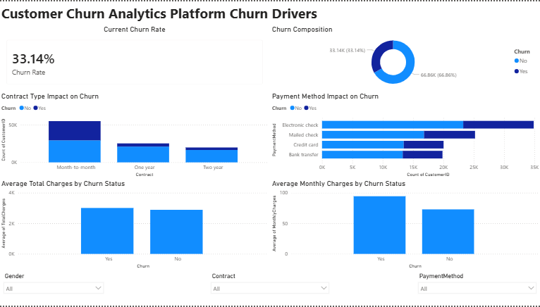
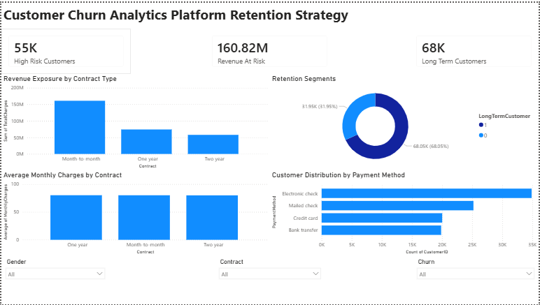

# Customer Churn Analytics Platform

## Project Overview

This project analyzes customer churn behavior using Python, SQL, Power BI, and Machine Learning.

The objective is to identify key factors influencing customer churn and provide actionable retention strategies to improve customer loyalty and reduce revenue loss.

---

## Business Problem

Customer churn directly impacts company revenue and growth.

This project helps answer:

- Which customers are most likely to churn?
- What factors drive churn?
- How much revenue is at risk?
- What retention strategies should be prioritized?

---

## Dataset

- Records: 100,000 Customers
- Features: Age, Gender, Tenure, Contract, Payment Method, Monthly Charges, Total Charges, Churn Status

---

## Technology Stack

### Python
- Pandas
- NumPy
- Matplotlib
- Seaborn
- Scikit-learn

### SQL
- Customer Segmentation Analysis
- Revenue Analysis
- Churn Analysis

### Power BI
- Executive Dashboard
- Customer Analysis Dashboard
- Churn Drivers Dashboard
- Retention Strategy Dashboard

### Machine Learning
- Random Forest Classifier
- Feature Importance Analysis

---

## Project Structure

Customer-Churn-Analytics-Platform

├── data

├── notebooks

├── sql

├── powerbi

├── model

├── images

├── streamlit

├── README.md

---

## Key Insights

### Contract Type

- Month-to-month customers show the highest churn rate.
- Long-term contracts significantly improve retention.

### Customer Tenure

- Customers with lower tenure are more likely to churn.

### Monthly Charges

- Customers paying higher monthly charges churn more frequently.

### Revenue Risk

- A significant portion of revenue is concentrated among high-risk customer segments.

---

## Machine Learning Results

### Model

Random Forest Classifier

### Accuracy

74.08%

### Top Predictors

1. Monthly Charges
2. Average Monthly Spend
3. Total Charges
4. Tenure
5. Contract Type

---

## Power BI Dashboards

### Executive Overview

### Customer Analysis

### Churn Drivers

### Retention Strategy

---

## Business Recommendations

- Convert month-to-month customers into annual contracts.
- Offer loyalty rewards to high-risk customers.
- Focus retention efforts on customers with low tenure.
- Provide personalized pricing plans for high-spend customers.

---

## Author

Atharva Khachane

Data Analyst | SQL | Python | Power BI | Machine Learning
